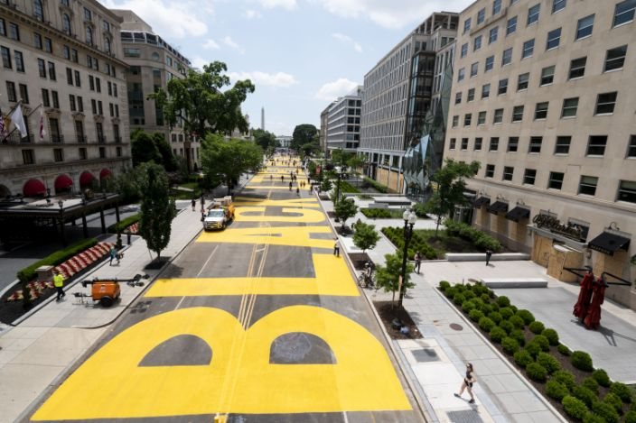

In the wake of the murder of George Floyed in the Twin Cities, we thought we could help lend perspective by applying GIS tools to a database of incidents where invidiuals were killed while in police custody in the United States. The data include the location and time of the incidents as well as myriad details about the victim's race, alledged crime and details about the offending officer.

It is not our intent to apply any prejudice to this dataset. Of course, do not wish to approach the study expecting that the victims of police killing "got what was coming" nor that police executioners were acting extrajudiciously in all cases. Better to let the data speak for themselves, by slicing and observing from many angles to build a broader picture of trends and patterns.

## Goals
- Examine spacially the rate of incidents in America. While analyzing, focus on regions (yeah, mostly cities) with interesting or unexpected distributions of crime.

- Analyze to what extent the victim's race explains the location or rate of police execution.

- The data are missing the broader context of arrest, or more generally police - public interactions. Without this, it is difficult even to assertain what fraction of interactions result in police execution, and do what extect this factor is explained by race.

## Expectations
WE HAVE no pre-formed expectations, DIDN'T YOU HEAR ME?

## Source
[Police Brutality Database](https://mappingpoliceviolence.org/)
